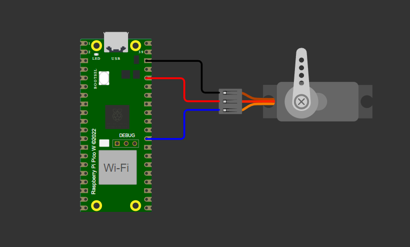
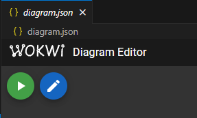

# Controlando um display com o RP2040 via UART, utilizando os conceitos de interrupção e controlando uma matriz de LEDs WS2812

## Sumário

1. [💡 O que é este projeto](#1--o-que-é-este-projeto)
2. [⚡ Diagrama do hardware](#2--diagrama-do-hardware)
3. [🎥 Vídeo demonstrativo](#3--vídeo-demonstrativo)
4. [🔎 Funcionalidades disponíveis](#4--funcionalidades-disponíveis)
5. [🧰 Pré-requisitos para executar](#5--pré-requisitos-para-executar)
6. [💻 Como executar a simulação](#6--como-executar-a-simulação)
7. [👥 Colaboradores do projeto](#7--colaboradores-do-projeto)
8. [✨ Recursos para versionamento](#8--recursos-para-versionamento)

## 1. 💡 O que é este projeto

Este é um firmware escrito em C para controlar um servomotor utilizando o módulo PWM do microcontrolador RP2040. O projeto permite definir posições específicas do servo e executar uma movimentação contínua e suave entre os ângulos de 0°, 90° e 180°.

## 2. ⚡ Diagrama do hardware

Os componentes são conectados de acordo com o esquema abaixo:

## 3. 🎥 Vídeo demonstrativo

Uma demonstração do projeto em funcionamento pode ser assistida no link abaixo:

https://drive.google.com/file/d/1noO-QkQe8okJEUk4J9svp_KGS_QmHcZD/view?usp=sharing

## 4. 🔎 Funcionalidades disponíveis

O firmware permite as seguintes ações:

- Controlar o servomotor através de sinais PWM gerados pelo Raspberry Pi Pico W;
- Ajustar o ângulo do servo para 0°, 90° e 180° de forma precisa;
- Executar uma movimentação periódica suave entre 0° e 180° com incremento controlado;

## 5. 🧰 Pré-requisitos para executar

A configuração sugerida para executar o projeto é:

1. Ter o [Pico SDK](https://github.com/raspberrypi/pico-sdk) instalado na sua máquina;
2. Ter o [ARM GNU Toolchain](https://developer.arm.com/Tools%20and%20Software/GNU%20Toolchain) instalado na sua máquina;
3. Ter o [Visual Studio Code](https://code.visualstudio.com/download) instalado na sua máquina;
4. Ter este repositório clonado na sua máquina;
5. Ter as seguintes extensões instaladas no seu VS Code:
- [C/C++](https://marketplace.visualstudio.com/items?itemName=ms-vscode.cpptools);
- [CMake](https://marketplace.visualstudio.com/items?itemName=twxs.cmake);
- [CMake Tools](https://marketplace.visualstudio.com/items?itemName=ms-vscode.cmake-tools);
- [Raspberry Pi Pico](https://marketplace.visualstudio.com/items?itemName=raspberry-pi.raspberry-pi-pico);
- [Wokwi Simulator](https://marketplace.visualstudio.com/items?itemName=Wokwi.wokwi-vscode).

## 6. 💻 Como executar a simulação

Com os pré-requisitos atendidos, siga os passos a seguir:

1. Utilize o VS Code para abrir a pasta raiz do projeto clonado:

2. Clique em "Compile", à direita da barra de status e aguarde o processo:

3. Abra o arquivo `diagram.json` e clique no botão de play para iniciar a simulação:

4. Quando a simulação iniciar, pressione os botões do teclado matricial para testar o firmware.

## 7. 👥 Colaboradores do projeto

Autora do projeto:

### Desenvolvedora

#### Cibelle Sousa Rodrigues

## 8. ✨ Recursos para versionamento

### Conventional Commits

Conventional Commits seguem uma estrutura fixa como feat, fix, docs e style, o que facilita identificar o escopo das mudanças. Isso ajuda a organizar o histórico e facilita o versionamento (por exemplo, ao definir o número da próxima versão do software).

### Labels no repositório

As labels em pull requests ajudam a identificar o escopo das tarefas. Nesse projeto, utilizamos:

- `bugfix`: para correção de bugs
- `documentação`: para indicar melhorias ou inclusões na documentação
- `refatoração`: para indicar mudanças na estrutura do código
- `readonly`: para indicar informação ou histórico
- `novidade`: para indicar a implementação de uma nova feature

### Branches nomeadas segundo o escopo

A nomeação de branches como `feature/...`, `docs/...` ou `bugfix/...` organiza o fluxo de trabalho e indica o propósito da branch, facilitando o entendimento. Portanto, foi um recurso adotado durante o desenvolvimento do projeto.

### Diretivas de pré-processamento

Neste projeto, utilizamos macros para definir os pinos associados ao servomotor. O servo está configurado no pino 12 do Raspberry Pi Pico W.
